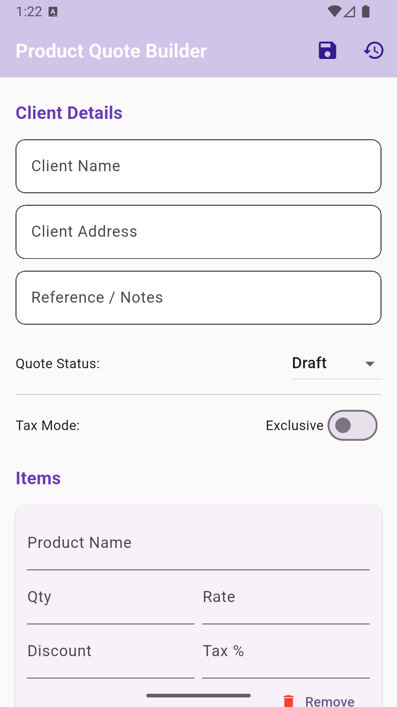
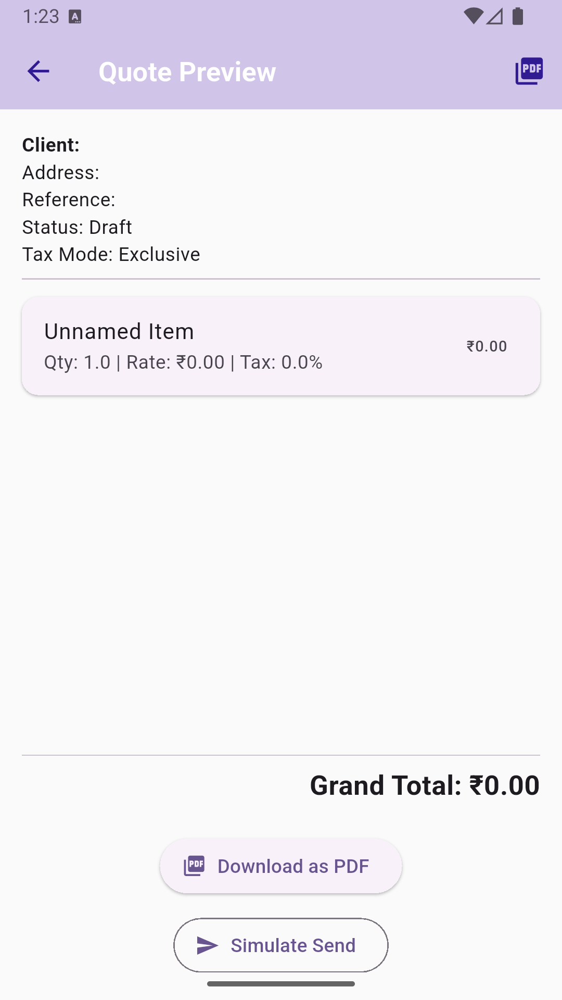

# 🧾 Product Quote Builder (Flutter)

A beginner-friendly Flutter application to create, manage, and export professional product quotes — built for an internship task at **Meru Technosoft Pvt. Ltd.**

---

## ✨ Features

✅ Add client details (name, address, reference)  
✅ Add multiple products dynamically  
✅ Automatic total calculation  
✅ Quote Status — Draft / Sent / Accepted  
✅ Tax mode — Inclusive / Exclusive  
✅ Currency formatting (₹, Indian format)  
✅ Save quotes locally using SharedPreferences  
✅ View saved quotes  
✅ Export quotes as PDF  
✅ Clean Material 3 UI with a Splash Screen  

---

## 🧠 Tech Stack

| Category | Tools Used |
|-----------|------------|
| Language | Dart |
| Framework | Flutter |
| Local Storage | Shared Preferences |
| PDF Generation | pdf & printing |
| Formatting | intl |

---

## 🛠️ Setup Instructions

```bash
git clone https://github.com/Karanx11/product_quote_builder.git
cd product_quote_builder
flutter pub get
flutter run
```

📸 Screenshots




👨‍💻 Developer

Karan Sharma

⭐ If you like this project, give it a star on GitHub!